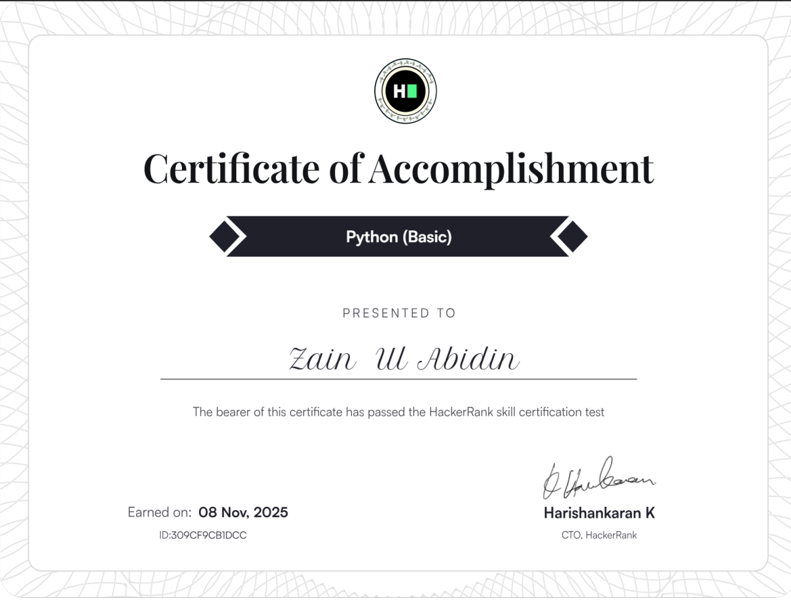

<div align="center">

# 🐍 Python Learning Roadmap 2026

[](https://www.python.org/)
[]()
[]()
[](LICENSE)

*A comprehensive journey through Python programming - from fundamentals to advanced concepts*

</div>

---

## 📖 About This Repository

Welcome to my **Python Learning Roadmap 2026**! This repository documents my journey in mastering Python programming. Here, you'll find my daily progress, projects, exercises, and achievements as I work towards becoming a proficient Python developer.

This is a living document that grows with my knowledge and skills, serving as both a learning tracker and a portfolio of my Python expertise.

---

## 🎯 Learning Goals

- ✅ **Master Python Fundamentals** - Variables, data types, control structures
- 📚 **Object-Oriented Programming** - Classes, inheritance, polymorphism
- 🔧 **Advanced Python Concepts** - Decorators, generators, context managers
- 📊 **Data Science & Analysis** - NumPy, Pandas, Matplotlib
- 🌐 **Web Development** - Flask/Django frameworks
- 🤖 **Automation & Scripting** - System automation, task scheduling
- 🧪 **Testing & Best Practices** - Unit testing, code quality, PEP 8
- 🗄️ **Database Integration** - SQL, NoSQL, ORMs
- 🚀 **Real-World Projects** - Building production-ready applications

---

## 📚 Learning Modules

<details>
<summary><b>Module 1: Python Fundamentals</b> ✅</summary>

- ✅ Variables and Data Types
- ✅ Operators and Expressions
- ✅ Control Flow (if, elif, else)
- ✅ Loops (for, while)
- ✅ Functions and Parameters
- ✅ Built-in Functions
- ✅ Basic Input/Output

</details>

<details>
<summary><b>Module 2: Data Structures</b> 🔄</summary>

- 🔄 Lists and List Comprehensions
- 🔄 Tuples and Sets
- 🔄 Dictionaries
- 🔄 Strings and String Methods
- ⏳ Stack and Queues
- ⏳ Advanced Data Structures

</details>

<details>
<summary><b>Module 3: Object-Oriented Programming</b> ⏳</summary>

- ⏳ Classes and Objects
- ⏳ Inheritance and Polymorphism
- ⏳ Encapsulation and Abstraction
- ⏳ Magic Methods
- ⏳ Design Patterns

</details>

<details>
<summary><b>Module 4: Advanced Python</b> ⏳</summary>

- ⏳ Decorators
- ⏳ Generators and Iterators
- ⏳ Context Managers
- ⏳ Lambda Functions
- ⏳ Regular Expressions
- ⏳ File Handling

</details>

<details>
<summary><b>Module 5: Libraries & Frameworks</b> ⏳</summary>

- ⏳ NumPy for Numerical Computing
- ⏳ Pandas for Data Analysis
- ⏳ Matplotlib & Seaborn for Visualization
- ⏳ Flask/Django Web Frameworks
- ⏳ Requests for API Integration
- ⏳ Beautiful Soup for Web Scraping

</details>

**Legend:** ✅ Completed | 🔄 In Progress | ⏳ Upcoming

---

## 🏆 Certifications & Achievements

<div align="center">

### Python Basics Certification


*Successfully completed Python Basics certification*

</div>

---

## 💻 Skills & Technologies

```python
skills = {
    "Languages": ["Python 3.x"],
    "Core Concepts": ["Variables", "Functions", "Control Flow", "Loops"],
    "Tools": ["Git", "GitHub", "VS Code"],
    "Currently Learning": ["OOP", "Data Structures", "Algorithms"],
    "Next Up": ["Web Development", "Data Science", "Automation"]
}
```

---

## 📈 Progress Tracker

```
├── Week 1-2:  ████████████████████ 100% - Python Fundamentals
├── Week 3-4:  ██████░░░░░░░░░░░░░░  30% - Data Structures
├── Week 5-6:  ░░░░░░░░░░░░░░░░░░░░   0% - OOP Concepts
├── Week 7-8:  ░░░░░░░░░░░░░░░░░░░░   0% - Advanced Topics
└── Week 9+:   ░░░░░░░░░░░░░░░░░░░░   0% - Projects & Practice
```

---

## 🚀 Projects

*Coming Soon! This section will showcase various Python projects as I progress through my learning journey.*

### Planned Projects:
- 🎮 Console-based Games
- 📊 Data Analysis Dashboard
- 🌐 Web Application
- 🤖 Automation Scripts
- 📝 Task Management System

---

## 🛠️ How to Use This Repository

1. **Browse the Modules**: Explore different learning modules to see progress
2. **Check Certifications**: View achievements and completed courses
3. **Follow Along**: Use this roadmap as inspiration for your own Python journey
4. **Contribute**: Suggestions and feedback are always welcome!

---

## 📝 Daily Learning Log

I maintain a consistent learning schedule, dedicating time each day to:
- 📖 Study new concepts
- 💻 Practice coding exercises
- 🏗️ Build mini-projects
- 📚 Review and reinforce previous topics
- 🎯 Work towards certification goals

---

## 🤝 Contributing

While this is a personal learning repository, I welcome:
- 📣 Suggestions for learning resources
- 💡 Project ideas
- 🐛 Bug reports in my code
- 🌟 General feedback and encouragement

Feel free to open an issue or reach out!

---

## 📬 Connect With Me

I'm always excited to connect with fellow Python learners and developers!

- 💼 **GitHub**: [@xainy75](https://github.com/xainy75)
- 📧 **Questions?** Feel free to open an issue

---

## 📜 License

This project is open source and available under the [MIT License](LICENSE).

---

<div align="center">

### 🌟 "The journey of a thousand miles begins with a single line of code" 🌟

**Keep Learning | Keep Coding | Keep Growing**

⭐ Star this repo if you find it helpful!

---

*Last Updated: February 2026*

</div>
